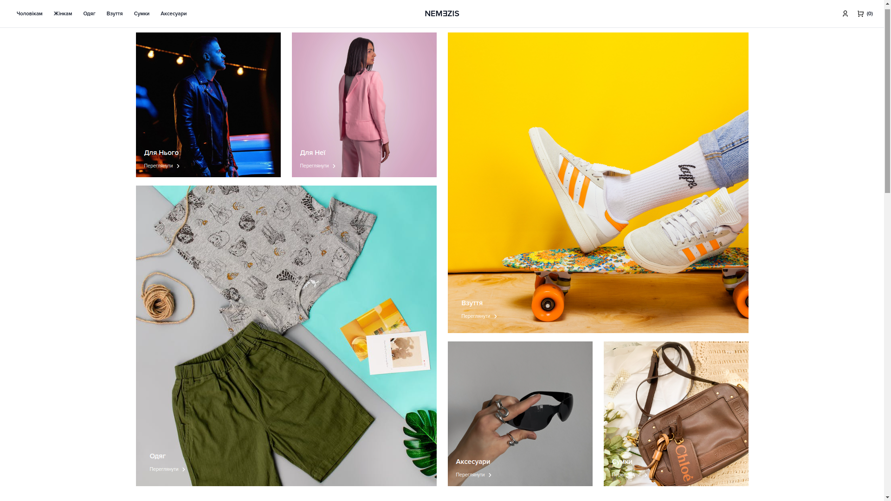

 

    <h3 align="center">
        Nemezis - Ecommerce website
    </h3>

  

    Website for my online bussiness created with medusa.js
     
    <a href="https://github.com/HackHead/nemezis.ua/issues">Report Bug</a>
    ·
    <a href="https://github.com/HackHead/nemezis.ua/issues">Request Feature</a>
  

<!-- ABOUT THE PROJECT -->
## About The Project
Nemezis.ua - is a website create for my online bussiness. I added some changes into a storefront templated and category filtering logic.

(<a href="#readme-top">back to top</a>)

<!-- CONTRIBUTING -->
## Contributing

Project is closed for contribution

(<a href="#readme-top">back to top</a>)

<!-- CONTACT -->
## Contact

SolomonAndrew@tutanota.com

[PROJECT LINK](https://github.com/HackHead/nemezis.ua)

(<a href="#readme-top">back to top</a>)

